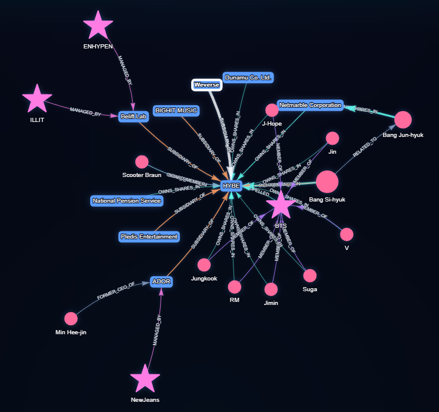

# 🎵 HYBE Ownership Knowledge Graph

[](https://dkt2025.github.io/hybe-knowledge-graph/)
[](https://neo4j.com/)
[](https://opensource.org/licenses/MIT)

Interactive Neo4J knowledge graph visualization of K-pop giant HYBE's ownership structure, subsidiaries, and corporate relationships.



## 🌟 Features

- **Interactive Visualization**: Explore HYBE's complex ownership structure through an interactive graph
- **Multiple Views**: Pre-configured views for ownership, subsidiaries, BTS network, and more
- **Real-time Data**: Connect to your own Neo4J database with live data
- **Detailed Information**: Hover over nodes and edges to see ownership percentages, valuations, and relationships
- **Responsive Design**: Works seamlessly on desktop and mobile devices

## 🚀 Live Demo

**👉 [View Live Demo](https://dkt2025.github.io/hybe-knowledge-graph/)**

## 📊 What's Inside

The knowledge graph includes:

- **41.65 million** HYBE shares tracked
- **20+ organizations** including HYBE and all subsidiaries
- **17 individuals** including executives and BTS members
- **4 musical groups** (BTS, NewJeans, ENHYPEN, ILLIT)
- **100+ relationships** mapping ownership, management, and corporate structure

### Data Coverage

- Ownership stakes from 0.0003% to 31.57%
- Market capitalization: $5.37 billion (as of Sept 9, 2024)
- Financial data in USD and KRW
- Historical events from 2000-2024

## 🛠️ Setup Instructions

### Prerequisites

- [Neo4J Aura](https://neo4j.com/cloud/aura-free/) account (free tier available)
- Basic understanding of Cypher query language (optional)

### Quick Start

1. **Clone this repository**
   ```bash
   git clone https://github.com/dkt2025/hybe-knowledge-graph.git
   cd hybe-knowledge-graph
   ```

2. **Create a Neo4J Aura database**
   - Sign up at [Neo4J Aura](https://neo4j.com/cloud/aura-free/)
   - Create a new free database instance
   - Save your connection credentials

3. **Import the data**
   - Open your Neo4J Aura Query console
   - Run the Cypher scripts in order from the `/cypher-scripts` folder:
     ```
     01_create_constraints.cypher
     02_create_organizations.cypher
     03_create_persons.cypher
     04_create_groups_products_events.cypher
     05_create_ownership_relationships.cypher
     06_create_corporate_relationships.cypher
     07_create_artist_relationships.cypher
     08_create_event_topic_relationships.cypher
     ```

4. **Open the visualization**
   - Open `index.html` in your browser, or
   - Visit the [live demo](https://dkt2025.github.io/hybe-knowledge-graph/)
   - Enter your Neo4J connection details
   - Click "Connect & Visualize"

## 📁 Repository Structure

```
hybe-knowledge-graph/
├── index.html              # Main visualization page
├── styles.css              # Styling
├── app.js                  # Visualization logic
├── README.md               # This file
├── LICENSE                 # MIT License
├── cypher-scripts/         # Database import scripts
│   ├── 01_create_constraints.cypher
│   ├── 02_create_organizations.cypher
│   ├── 03_create_persons.cypher
│   ├── 04_create_groups_products_events.cypher
│   ├── 05_create_ownership_relationships.cypher
│   ├── 06_create_corporate_relationships.cypher
│   ├── 07_create_artist_relationships.cypher
│   ├── 08_create_event_topic_relationships.cypher
│   └── 09_useful_queries.cypher
├── data/                   # Raw data
│   └── hybe_ownership_knowledge_graph.csv
├── docs/                   # Documentation
│   ├── INSTALLATION.md
│   ├── QUERIES.md
│   └── SCHEMA.md
└── assets/                 # Images and media
    └── preview.png
```

## 🎯 Usage Examples

### View All Shareholders
```cypher
MATCH (owner)-[r:OWNS_SHARES_IN]->(hybe:Organization {name: 'HYBE'})
RETURN owner, r, hybe
ORDER BY r.percentage DESC
```

### Explore BTS Network
```cypher
MATCH (member:Person)-[:MEMBER_OF]->(bts:Group {name: 'BTS'})
MATCH (member)-[owns:OWNS_SHARES_IN]->(hybe:Organization {name: 'HYBE'})
RETURN member, bts, owns, hybe
```

### Find Corporate Structure
```cypher
MATCH (sub)-[r:SUBSIDIARY_OF]->(hybe:Organization {name: 'HYBE'})
RETURN sub, r, hybe
```

See `/cypher-scripts/09_useful_queries.cypher` for 20+ pre-written queries.

## 📊 Graph Schema

### Node Types
- **Organization**: Companies and business entities
- **Person**: Individuals (executives, artists, founders)
- **Group**: Musical groups
- **Product**: Products and services
- **Event**: Significant events
- **Concept**: Business concepts
- **Topic**: Themes and issues

### Relationship Types
- `OWNS_SHARES_IN`: Ownership stakes
- `SUBSIDIARY_OF`: Corporate hierarchy
- `MEMBER_OF`: Group membership
- `MANAGED_BY`: Artist-label relationships
- `CEO_OF` / `PRESIDENT_OF`: Leadership roles
- `FOUNDED`: Founder relationships
- And 15+ more...

## 🤝 Contributing

Contributions are welcome! Please feel free to submit a Pull Request.

1. Fork the repository
2. Create your feature branch (`git checkout -b feature/AmazingFeature`)
3. Commit your changes (`git commit -m 'Add some AmazingFeature'`)
4. Push to the branch (`git push origin feature/AmazingFeature`)
5. Open a Pull Request

## 📄 Data Source

This knowledge graph is based on the article:

**"Who owns K-pop giant HYBE?"**  
By Daniel Tencer  
Music Business Worldwide  
Published: September 10, 2024  
[Read the article](https://www.musicbusinessworldwide.com/who-owns-k-pop-giant-hybe/)

## 📝 Citation

If you use this knowledge graph in your research or project, please cite:

```bibtex
@misc{hybe-knowledge-graph-2025,
  author = {dkt2025},
  title = {HYBE Ownership Knowledge Graph},
  year = {2025},
  publisher = {GitHub},
  url = {https://github.com/dkt2025/hybe-knowledge-graph}
}
```

## 📜 License

This project is licensed under the MIT License - see the [LICENSE](LICENSE) file for details.

## 🙏 Acknowledgments

- Data source: [Music Business Worldwide](https://www.musicbusinessworldwide.com/)
- Built with [Neo4J](https://neo4j.com/)
- Visualization powered by [neovis.js](https://github.com/neo4j-contrib/neovis.js/)
- Inspired by the K-pop industry's fascinating corporate structure

## 📧 Contact

Created by [@dkt2025](https://github.com/dkt2025)

Have questions or suggestions? [Open an issue](https://github.com/dkt2025/hybe-knowledge-graph/issues)!

---

**Star ⭐ this repo if you find it useful!**